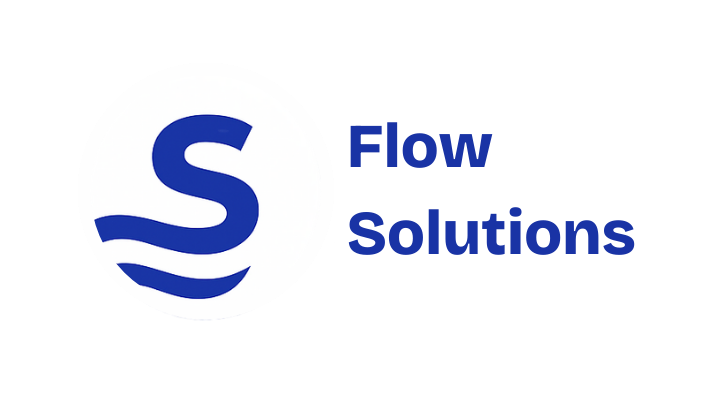
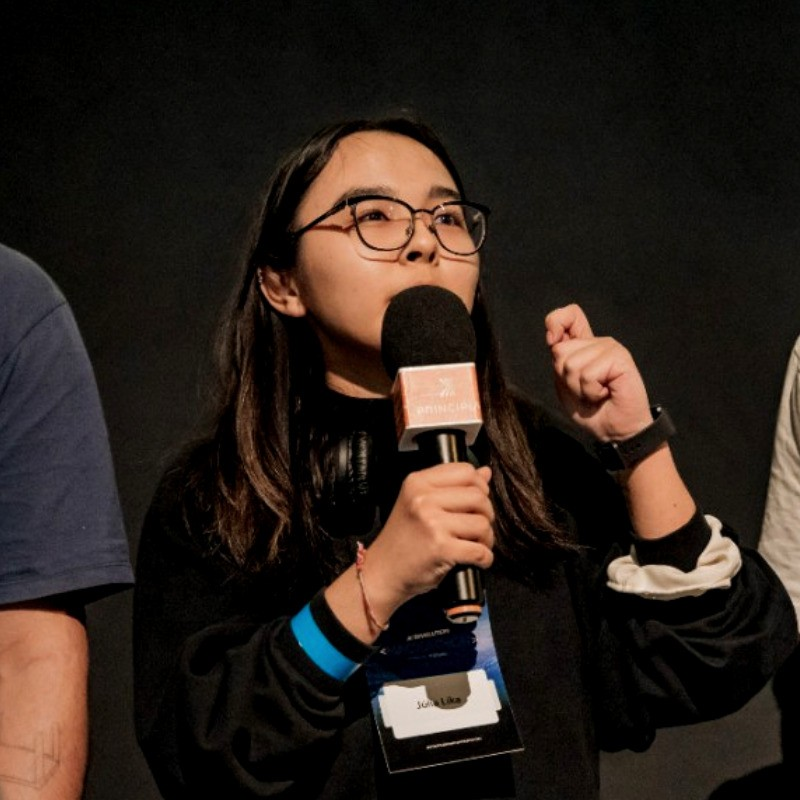

# Inteli - Instituto de Tecnologia e Liderança 

<p align="center">
<a href= "https://www.inteli.edu.br/"></a>
</p>

<br>

# Grupo: Flow Solutions

## Projeto: Sync Telemetry

<p align="center">

</p>

### Membros

<div align="center">
    <table>
        <tr>
            <td align="center"><a href="https://www.linkedin.com/in/bruno-jancso-fabiani-0272532b3/"><br><sub><b>Bruno Jancsó Fabiani</b></sub></a> <a href="https://www.linkedin.com/in/bruno-jancso-fabiani-0272532b3/"></a></td>
            <td align="center"><a href="https://www.linkedin.com/in/caio-alcantara-santos/"><br><sub><b>Caio de Alcantara Santos</b></sub></a> <a href="https://www.linkedin.com/in/caio-alcantara-santos/"></a></td>
            <td align="center"><a href="https://www.linkedin.com/in/gabriel-martins-alves/"><br><sub><b>Gabriel Martins Alves</b></sub></a> <a href="https://www.linkedin.com/in/gabriel-martins-alves/"></a></td>
            <td align="center"><a href="https://www.linkedin.com/in/gustavo-dacosta/"><br><sub><b>Gustavo da Costa</b></sub></a> <a href="https://www.linkedin.com/in/gustavo-dacosta/"></a></td>
            <td align="center"><a href="https://www.linkedin.com/in/julia-lika-ishikawa/"><br><sub><b>Julia Lika Ishikawa</b></sub></a> <a href="https://www.linkedin.com/in/julia-lika-ishikawa/"></a></td>
            <td align="center"><a href="https://www.linkedin.com/in/luizapetenazzi/"><br><sub><b>Luiza Petenazzi</b></sub></a> <a href="https://www.linkedin.com/in/luizapetenazzi/"></a></td>
            <td align="center"><a href="https://www.linkedin.com/in/pietrabatista/"><br><sub><b>Pietra Batista</b></sub></a> <a href="https://www.linkedin.com/in/pietrabatista/"></a></td>
        </tr>
    </table>
</div>

## 👩‍🏫 Professores:
### Coordenador(a) de curso
- <a href="https://www.linkedin.com/in/michele-bazana-de-souza-69b77763/">Michele Bazana de Souza</a>
### Orientador(a) 
- <a href="https://www.linkedin.com/in/murilo-zanini-de-carvalho-0980415b/">Murilo Zanini de Carvalho</a>
### Instrutores
- <a href="https://www.linkedin.com/in/vthayashi/">Victor Hayashi</a>
- <a href="https://www.linkedin.com/in/filipe-gon%C3%A7alves-08a55015b/">Filipe Gonçalves de Souza Nogueira da Silva</a> 
- <a href="https://www.linkedin.com/in/gui-cestari/">Guilherme Henrique de Oliveira Cestari</a> 
- <a href="https://www.linkedin.com/in/lisane-valdo/">Lisane Valdo</a>
- <a href="https://www.linkedin.com/in/rodrigo-mangoni-nicola-537027158/">Rodrigo Mangoni Nicola</a>
- <a href="http://linkedin.com/in/diogo-martins-gon%C3%A7alves-de-morais-96404732/">Diogo Martins Gonçalves de Morais</a>

## 📜 Descrição

&emsp;A Itubombas Locação Comércio Importação e Exportação Ltda. é uma empresa com 22 anos de mercado, consolidada como líder nacional na locação de motobombas para a movimentação de fluídos. Seu diferencial competitivo reside não apenas no fornecimento do equipamento, mas em oferecer uma solução completa que inclui todo o suporte necessário para a operação, como mangueiras, conexões e sistemas de automação.

&emsp;Desde 2017, a Itubombas faz parte do grupo multinacional Atlas Copco, o que reforça sua posição de destaque no mercado brasileiro. A empresa atende a setores críticos da economia, como **mineração, construção civil, saneamento, indústria petroquímica, portos e dragagens**, onde a continuidade e a eficiência operacional são essenciais.

&emsp;O objetivo central deste projeto é desenvolver uma solução de Inteligência Artificial (IA) capaz de **prever falhas em motobombas antes que elas ocorram**. A meta é transformar a manutenção corretiva (agir após a quebra) em uma abordagem proativa e preditiva (agir antes da quebra).

## 📁 Estrutura de pastas

Dentre os arquivos e pastas presentes na raiz do projeto, definem-se:

- <b>docs</b>: aqui estão todos os documentos do projeto.

- <b>src</b>: Todo o código fonte criado para o desenvolvimento do projeto, incluindo firmware, notebooks, backend e frontend, se aplicáveis.

- <b>README.md</b>: arquivo que serve como guia e explicação geral sobre o projeto (o mesmo que você está lendo agora).

### Guia de Como Rodar a Documentação do Projeto

A documentação do projeto foi feita utilizando a ferramenta Docusaurus, que é útil quando se é necessário criar artefatos de documentação visualmente agradáveis em um curto espaço de tempo. Assim, esse guia explica como configurar o ambiente e rodar o código da documentação, que consiste em uma aplicação web contendo tudo o que foi desenvolvido durante as 5 sprints de projeto.


#### **Pré-requisitos**  
Antes de começar, certifique-se de ter os seguintes programas instalados:  
- [Visual Studio Code (VSCode)](https://code.visualstudio.com/)  
- [Node JS v18.0 ou superior](https://nodejs.org/pt/download)
- [Git](https://git-scm.com/downloads)  

#### **Passo a Passo**  

##### 1. Clonar o repositório  
Abra o terminal e execute o comando:  

```bash
git clone https://github.com/Inteli-College/2025-2A-T12-EC07-G03.git
```

##### 2. Entre na pasta de documentação  
No VsCode, abra um terminal na raíz (pasta inicial do projeto) e rode o comando:  

```bash
cd docs
```

##### 3. Instalando dependências  
Para instalar as dependências, no mesmo terminal do passo anterior, rode:  

```bash
npm install
```

Caso não possua o npm, em sistemas Linux/Ubuntu/Debian, rode:

```bash
sudo apt install npm
```

Note que para sistemas como Windows (e normalmente também em Linux e MacOS) o npm já é instalado junto com o Node. 

##### 4. Rodando a documentação  

Estando em "C:/Users/Seu-Usuário/Caminho-para-pasta/2025-1A-T12-EC05-G01/docs>, ou seja, na pasta ```docs``` do projeto, rode, no mesmo terminal dos passos anteriores, o seguinte comando:

```bash
npm start
```

Após rodar este comando, você verá algumas informações no terminal. A primeira vez rodando a documentação pode levar alguns minutos, então tenha paciência. Caso tudo ocorra corretamente, ao final da inicialização será possível acessar a documentação no navegador através da url [localhost:3000](localhost:3000). Conseguindo visualizar a documentação, você será capaz de ver tudo o que foi desenvolvido em cada sprint do projeto.

Ou acesse através do link: https://inteli-college.github.io/2025-2A-T12-EC07-G03/

## 🗃 Histórico de lançamentos

### 0.5.0 - 09/10/2025

### 0.4.0 - 26/09/2025 

### 0.3.0 - 12/09/2025

### 0.2.0 - 29/08/2025

### 0.1.0 - 15/08/2025

## 📋 Licença/License

<p xmlns:cc="http://creativecommons.org/ns#" xmlns:dct="http://purl.org/dc/terms/"><a property="dct:title" rel="cc:attributionURL">Flow Solutions</a> by <a rel="cc:attributionURL dct:creator" property="cc:attributionName" href="https://www.inteli.edu.br/">Inteli</a>, <a href="https://github.com/BrunoFabiani">Bruno Jancsó Fabiani</a>, <a href="https://github.com/caio-alcantara">Caio de Alcantara Santos</a>, <a href="https://github.com/gabrielmartinscoding">Gabriel Martins Alves</a>, <a href="https://github.com/GustavoDaCostaRezende">Gustavo da Costa</a>, <a href="https://github.com/JuliaLika">Julia Lika Ishikawa</a>, <a href="https://github.com/luizapetenazzi">Luiza Petenazzi</a>, <a href="https://github.com/pietrabatista">Pietra Batista</a>
